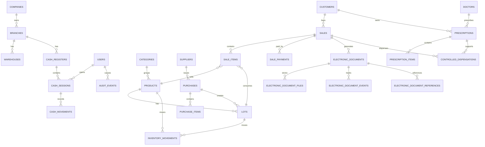

# FarmaGo - Arquitectura y modelo de datos objetivo

## 1. Arquitectura recomendada

FarmaGo debe evolucionar como monolito modular Laravel. El dominio requiere consistencia transaccional fuerte entre venta, caja, inventario y comprobante, por lo que un monolito modular es mas seguro que microservicios prematuros.

Capas:

- Presentacion: Blade/AdminLTE al inicio; API JSON para POS avanzado o app movil posterior.
- Aplicacion: casos de uso orquestados por servicios: RegistrarVenta, EmitirComprobante, AbrirCaja, RegistrarCompra.
- Dominio: reglas de negocio puras por modulo: stock, FEFO, recetas, CPE, caja.
- Infraestructura: Eloquent, colas, almacenamiento, integracion SUNAT/OSE/PSE, generacion PDF/QR.
- Auditoria: transversal, captura eventos de dominio y cambios criticos.

Patrones clave:

- Transaction Script controlado para casos operativos simples.
- Domain Services para reglas complejas: VentaService, InventarioService, CpeService, CajaService.
- Outbox para eventos que deben enviarse a servicios externos.
- Adapter/Strategy para proveedor CPE: SUNAT directo, OSE o PSE.
- State Machine para comprobantes electronicos.
- Ledger para stock y caja: saldos derivados de movimientos.

## 2. Contextos/modulos

### Core

- Empresas
- Sucursales
- Configuracion
- Usuarios, roles, permisos
- Auditoria

### Inventario

- Productos
- Categorias
- Presentaciones
- Lotes
- Movimientos de inventario
- Alertas de vencimiento/stock

### Compras

- Proveedores
- Compras
- Detalle de compra
- Ingreso de lotes

### Ventas/POS

- Ventas
- Detalle de venta
- Medios de pago
- Descuentos autorizados
- Devoluciones y anulaciones operativas

### CPE

- Comprobantes electronicos
- Series y correlativos
- XML firmado
- PDF/ticket
- QR
- CDR
- Estados y errores
- Notas de credito/debito

### Caja

- Cajas
- Turnos de caja
- Movimientos de caja
- Arqueo y cierre

### Sanitario

- Recetas
- Medicos
- Pacientes/clientes
- Productos controlados
- Dispensacion controlada

### Reportes

- Operativos
- Tributarios
- Sanitarios
- Auditoria

## 3. Integracion CPE

### Componentes

- CpeBuilder: construye documento tributario interno.
- UblXmlGenerator: genera XML UBL.
- XmlSigner: firma el XML con certificado digital.
- PdfRenderer: genera PDF/ticket.
- QrGenerator: genera QR para representacion impresa.
- CpeSenderInterface: contrato de envio.
- SunatDirectSender / OseSender / PseSender: adaptadores.
- CdrParser: valida y guarda respuesta.
- CpeStateMachine: controla transiciones.
- CpeOutboxJob: envia/reintenta comprobantes pendientes.

### Estados recomendados

- draft
- generated
- signed
- queued
- sent
- accepted
- observed
- rejected
- voided
- retry_pending
- failed

Transiciones criticas:

- draft -> generated -> signed -> queued -> sent -> accepted
- sent -> observed -> retry_pending
- sent -> rejected
- accepted -> voided solo via nota/acto permitido

## 4. Modelo de datos conceptual

### Core

- companies
- branches
- warehouses
- users
- roles
- permissions
- system_settings
- audit_events

### Catalogos

- document_types
- tax_document_types
- identity_document_types
- currencies
- payment_methods
- sunat_catalog_items

### Inventario

- categories
- products
- product_presentations
- product_barcodes
- product_prices
- lots
- inventory_movements
- inventory_adjustments
- stock_alerts

### Compras

- suppliers
- purchases
- purchase_items

### Ventas y POS

- customers
- sales
- sale_items
- sale_payments
- sale_discounts
- returns

### CPE

- document_series
- electronic_documents
- electronic_document_items
- electronic_document_references
- electronic_document_files
- electronic_document_events
- cpe_provider_credentials

### Caja

- cash_registers
- cash_sessions
- cash_movements
- cash_count_details

### Recetas y controlados

- doctors
- prescriptions
- prescription_items
- controlled_dispensations

## 5. Entidades principales

### companies

- id
- ruc
- legal_name
- commercial_name
- fiscal_address
- ubigeo
- sol_user_encrypted
- sol_password_encrypted
- certificate_path
- certificate_password_encrypted
- cpe_provider_type: sunat, ose, pse
- active

### branches

- id
- company_id
- name
- code
- address
- ubigeo
- active

### products

- id
- category_id
- sku
- barcode
- name
- generic_name
- active_ingredient
- concentration
- pharmaceutical_form
- presentation
- unit_code
- sale_price
- purchase_tax_affectation_code
- requires_prescription
- is_controlled
- allows_fractional_sale
- cold_chain_required
- stock_min
- stock_max
- active

### lots

- id
- product_id
- purchase_id
- supplier_id
- lot_number
- expiration_date
- manufacture_date
- initial_quantity
- unit_cost
- active
- blocked_reason

### inventory_movements

- id
- branch_id
- warehouse_id
- product_id
- lot_id
- user_id
- type: in, out, adjustment, reversal, expired_block
- quantity
- unit_cost
- origin_type
- origin_id
- reason
- created_at

### sales

- id
- company_id
- branch_id
- cash_session_id
- customer_id
- user_id
- sale_datetime
- subtotal
- discount_total
- taxable_total
- exempt_total
- igv_total
- total
- status: draft, completed, cancelled, refunded

### sale_items

- id
- sale_id
- product_id
- lot_id
- quantity
- unit_price
- discount
- tax_affectation_code
- igv
- total
- prescription_required

### electronic_documents

- id
- company_id
- branch_id
- sale_id
- customer_id
- document_type: 01 factura, 03 boleta, 07 nota_credito, 08 nota_debito
- series
- number
- issue_date
- currency
- subtotal
- igv_total
- total
- xml_hash
- qr_payload
- provider_type
- sunat_status
- cdr_code
- cdr_description
- status
- sent_at
- accepted_at

### electronic_document_files

- id
- electronic_document_id
- file_type: xml, signed_xml, pdf, ticket_pdf, cdr_zip
- disk
- path
- sha256
- created_at

### cash_sessions

- id
- branch_id
- cash_register_id
- user_id
- opened_at
- closed_at
- opening_amount
- expected_amount
- counted_amount
- difference
- status: open, closed

### prescriptions

- id
- customer_id
- doctor_id
- prescription_number
- issue_date
- expiration_date
- diagnosis
- attachment_path
- status
- sensitive_data_access_level

### controlled_dispensations

- id
- prescription_id
- sale_id
- product_id
- lot_id
- quantity
- customer_id
- dispensed_by
- dispensed_at
- audit_event_id

## 6. Modelo entidad-relacion conceptual

## 7. Flujos principales

### Venta POS con boleta/factura

1. Cajero abre caja.
2. Escanea o busca producto.
3. Sistema valida producto activo, stock y lotes FEFO disponibles.
4. Si requiere receta, solicita receta valida.
5. Si es controlado, exige usuario autorizado y registro sanitario reforzado.
6. Se calcula subtotal, IGV, descuentos y total.
7. Se registran pagos.
8. Se crea venta y movimientos de inventario en transaccion.
9. Se crea comprobante electronico con serie/correlativo.
10. Se genera/firma XML y PDF/QR.
11. Se envia a proveedor CPE o queda en cola.
12. Se recibe CDR y se actualiza estado.

### Compra con ingreso de lotes

1. Usuario registra proveedor y documento de compra.
2. Ingresa productos, cantidades, lote, vencimiento y costo.
3. Sistema valida lote unico por producto.
4. Se registra compra.
5. Se crean lotes.
6. Se crean movimientos de inventario de entrada.
7. Se actualizan alertas de stock/vencimiento.

### Nota de credito

1. Usuario selecciona CPE aceptado.
2. Define motivo SUNAT y alcance: total/parcial.
3. Sistema valida que el documento referenciado exista y este aceptado.
4. Se genera nota con serie/correlativo propio.
5. Si hay devolucion de producto, se registra retorno a lote solo si aplica y esta permitido.
6. Se genera XML/PDF/QR y se envia.
7. Se almacena CDR y se actualiza estado.

### Cierre de caja

1. Cajero solicita cierre.
2. Sistema calcula esperado por medio de pago.
3. Cajero registra conteo.
4. Sistema calcula diferencia.
5. Diferencia requiere motivo.
6. Se cierra caja y se bloquean nuevos movimientos.
7. Auditoria registra resumen.

## 8. Reglas tecnicas transversales

- Toda operacion critica usa transacciones de base de datos.
- Integraciones externas se hacen por cola, con idempotencia y reintentos.
- Archivos tributarios se guardan con hash SHA-256.
- Datos sensibles se cifran en reposo cuando no sean necesarios en texto plano.
- Todas las tablas criticas tienen timestamps y, cuando aplique, user_id de creacion/modificacion.
- No se elimina informacion tributaria ni auditoria desde la app.
- Se usa soft delete solo en maestros, no en movimientos contables/tributarios.
- La configuracion por empresa/sucursal evita valores hardcoded.
